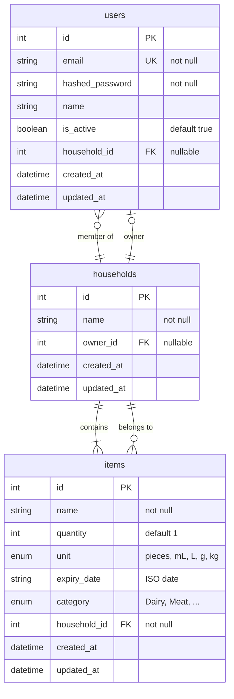

# FridgeBuddy – Entity Relationship Diagram

## Mermaid ER diagram

## Relationships

| From       | To         | Cardinality | Description |
|-----------|------------|-------------|-------------|
| users     | households | N : 1       | User belongs to one household (`household_id`). Optional (nullable). |
| households| users      | 1 : N       | Household has many members. |
| households| users      | 1 : 1       | Household has one owner (`owner_id`). Optional (nullable). |
| households| items      | 1 : N       | Household has many items. Items are cascade-deleted with the household. |
| items     | households | N : 1       | Item belongs to one household (`household_id`). |

## Table summary

- **users** – User accounts; can be linked to one household (fridge).
- **households** – Fridge/household; has an optional owner (`owner_id` → users.id) and many items.
- **items** – Food inventory rows; each belongs to one household.
